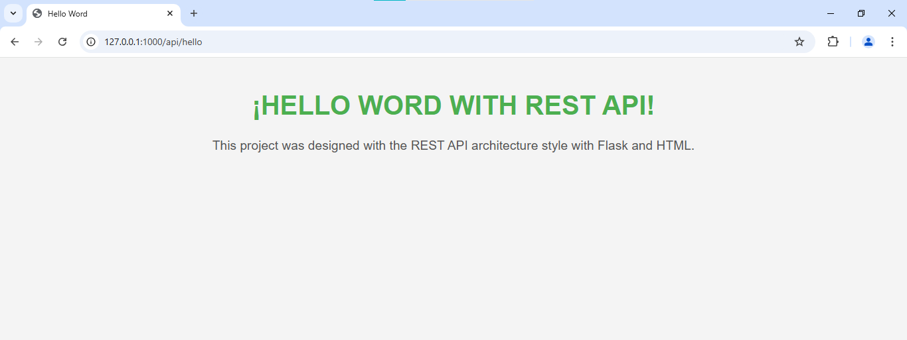

# 🌐 Flask REST API: Hello World  

This project is a basic application that uses **Flask** to serve an HTML file via a REST API. To understand the fundamentals of a REST server with Python and Flask. 



---

## 🚀 **Technologies Used**  
- **Backend**: Python, Flask  
- **Server**: Flask Development Server  
- **Frontend**: Static HTML  

---

## 📖 **Prerequisites**  
Before running this project, make sure you have the following components installed:  
1. **Python 3.10 or later**  
2. **Git**  
3. A text editor such as **Visual Studio Code** (optional).  

---

## 🛠️ **Steps to Set Up and Run the Project**  

### 1️⃣ Clone the Repository  
Use the following command to clone the project from GitHub:  
```
git clone https://github.com/ciizao/RestAPI_Python.git
```
### 2️⃣ Navigate to the Project Directory
Create a virtual environment to manage the project dependencies:
 ```
cd RestAPI_Python
```
### 3️⃣ Create a Virtual Environment
Create a virtual environment to manage the project dependencies:
 ```
python -m venv venv
```
### 4️⃣ Activate the Virtual Environment
- On **Windows**
 ```
venv\Scripts\activate
```
- On MAC/Linux
 ```
source venv/bin/activate
```
### 5️⃣ Install Dependencies
Use the `requirements.txt` file to install the necessary dependencies:
 ```
pip install -r requirements.txt
```
### 6️⃣ Run the Application
Start the Flask server with the following command:
 ```
python app.py
```
### 7️⃣  Access the API
Open your browser and go to the URL:
 ```
http://localhost:1000/api/hello
```
- You should see the content of the helloRestAPI.html file.

## 📂 Repository
* The source code for this project is available on GitHub:

```
https://github.com/ciizao/RestAPI_Python.git
```
